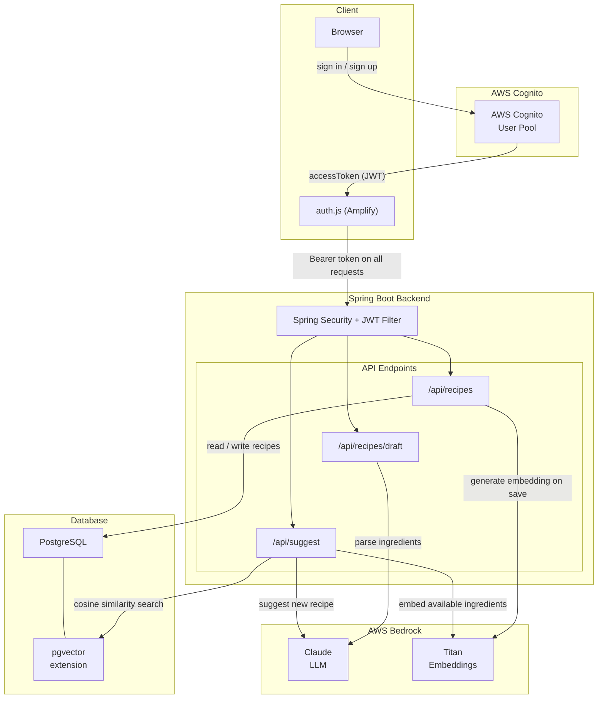
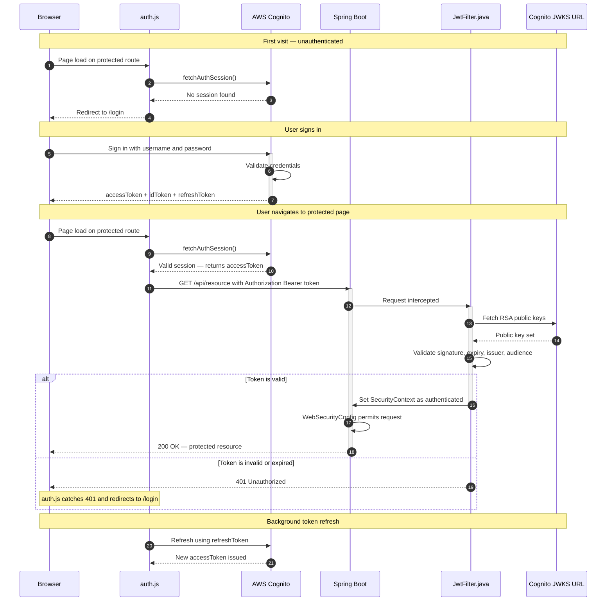
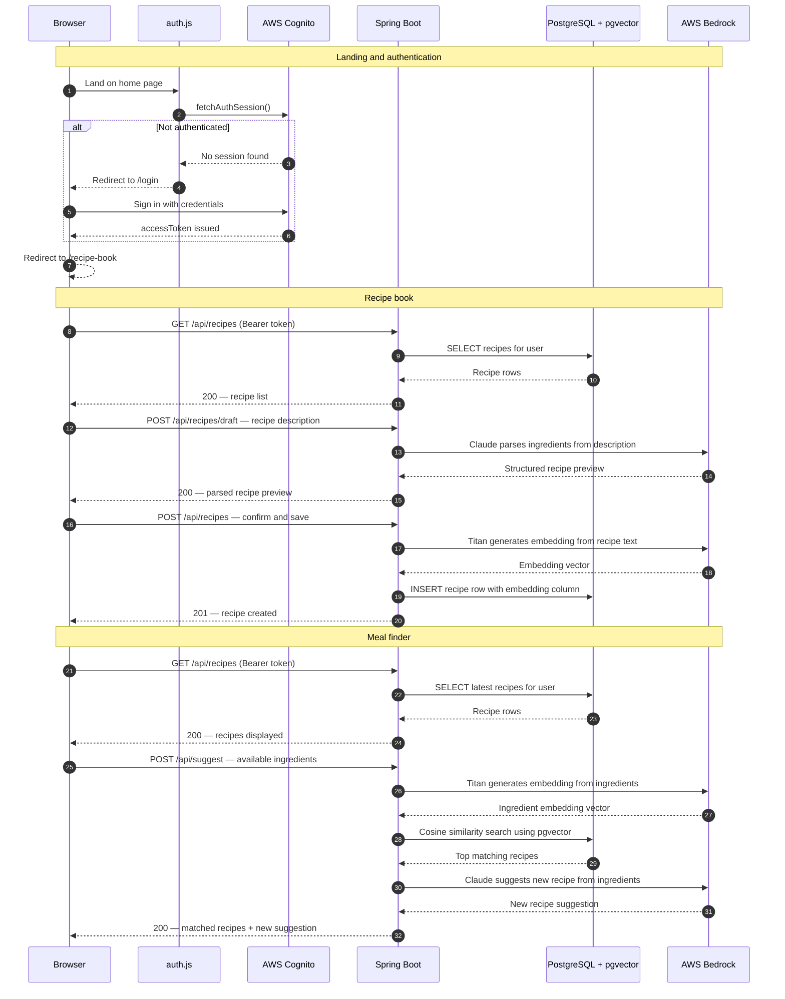

# Remi - Your Personal AI Chef

A full-stack RAG application that leverages a microservices architecture to record user-created recipes and returns the best matched recipes based on the available ingredients in the users' pantry. It also generates AI suggested recipes that can be made from the available ingredients. Built with Spring Boot, AWS Bedrock, AWS Cognito, Postgres, HTML, CSS and JavaScript. Deployed on Render.

## Architecture



Remi is a full-stack application built across three layers. The frontend is served by Spring Boot with JavaScript handling client-side authentication state via AWS Amplify. The backend is a REST API built with Spring Boot, responsible for all business logic, external service orchestration, and data persistence. All data is stored in a PostgreSQL database extended with pgvector, which enables the application to store and query vector embeddings natively alongside relational data.
Authentication is handled by AWS Cognito, which manages user identity, credential validation, and token lifecycle. AI capabilities are powered by AWS Bedrock, which provides access to two models: Claude for natural language understanding and recipe generation, and Amazon Titan for converting text into vector embeddings. 

### AWS Cognito, Spring Security - Authentication 
<details>
<summary>See Authentication Request Flow</summary>
    


Remi uses a JWT-based authentication supported by AWS Cognito. Amplify Auth provides methods to handle functions like sign-in, sign-out, and managing the tokens. Spring Security restricts the endpoints that can be accessed by the user depending on their session status. In every request, a Bearer token is passed which is verified by a JWT Filter by using the JWKS URL that has the Cognito public key. 

</details>


### RAG application flow

<details>
<summary>See RAG Application Flow</summary>




SpringBoot serves the frontend static links and handles the API calls made to fetch, save, and suggest recipes. It also manages the API calls that trigger LLM calls to AWS Bedrock, which in turn makes calls to two separate models, the Claude Haiku 4.5 and Titan Embeddings v2. 

The application takes user input in the form of natural language and parses it to identify the ingredients in the recipe and records the quantities when available. These ingredients are ranked based on their importance to the dish, and once the user confirms the parsing, they are converted into vector embeddings with additional importance given to the primary ingredients to accommodate the cases when the user only searches for the primary ingredient of the dish. These recipes are saved in Postgres and utilizes pgvector for handling calculating cosine similarity when searching for the most similar recipes based on the ingredients user has available.

When a user searches for recipes, an LLM call is also made to generate a new recipe based on the matches from the user's own recipes (puts the user's taste in context) and the available ingredients. 
</details>

---

## Tech Stack

| Layer | Technology |
|-------|-----------|
| Frontend | Google Stitch, Tailwind CSS, HTML, JavaScript |
| API Gateway | Spring Boot 4.0 |
| AI Service | Claude Haiku 4.5, Titan Embeddings v2 |
| Containerization | Docker, Docker Compose |
| Security | AWS Cognito, JWT, Spring Security, Amplify Auth |
| Cloud | Render |
| Build | Maven |

---

## Project Structure

```
.
├── Dockerfile
├── HELP.md
├── README.md
├── docker-compose.yml
├── .env
├── mvnw
├── mvnw.cmd
├── pom.xml
└── src
    └── main
        ├── java
        │   └── com
        │       └── example
        │           └── fridge_to_fork
        │               ├── FridgeToForkApplication.java
        │               ├── config
        │               │   ├── BedrockConfig.java
        │               │   ├── JwtFilter.java
        │               │   └── WebSecurityConfig.java
        │               ├── controller
        │               │   ├── RecipeController.java
        │               │   └── SuggestController.java
        │               ├── model
        │               │   ├── Ingredient.java
        │               │   ├── Recipe.java
        │               │   ├── SuggestionRequest.java
        │               │   └── SuggestionResult.java
        │               ├── repository
        │               │   └── RecipeRepository.java
        │               ├── service
        │               │   ├── EmbeddingService.java
        │               │   ├── NewRecipeSuggestionService.java
        │               │   └── RecipeParsingService.java
        │               └── util
        │                   └── IngredientConverter.java
        └── resources
            ├── META-INF
            │   └── additional-spring-configuration-metadata.json
            ├── application-local.properties
            ├── application-prod.properties
            ├── application.properties
            └── static
                ├── assets
                ├── auth.js
                ├── find.html
                ├── index.html
                ├── journal.html
                └── login.html

```

---

## Setup

### Prerequisites

- Java 21+
- Docker Desktop
- AWS CLI (for deployment only)
- Beekeeper Studio or similar (optional)

## Local Implementation

Save local DB credentials in a .env file placed at the root of the project.
```bash
DB_PASSWORD=your_password_here
DB_USERNAME=your_username_here
```

The attributes defined in the Recipe.java class are used by Hibernate to create a table in the DB if one is not already present. However when developing the project, there were some challenges with creating an embeddings column directly through Hibernate because Hibernate does not know how to map a vector(1024) PostgreSQL type to a java type out of the box. To work around this, the table is created through the attributes defined in Recipe.java, and an ALTER TABLE command is then run later to add the embedding column and bypass Hibernate altogether. 

The instructions to do this are as follows:

1. Ensure Docker Desktop is running and AWS profile is logged in.

To set up use
```bash
aws configure
```

To verify use
```bash
aws configure list
```

IMPORTANT: The AWS profile should be logged in the terminal where the following Docker and Maven commands will be executed. Otherwise, AWS Bedrock won't have user credentials.

```bash
# The docker compose up command starts the frontend and backend services as per the configurations in docker-compose.yml file.
docker-compose up -d
./mvnw spring-boot:run
```

2. If Beekeeper Studio (or similar) is available,

```bash
CREATE EXTENSION IF NOT EXISTS vector;
ALTER TABLE recipes ADD COLUMN IF NOT EXISTS embedding vector(1024);
```

2. If it is not available,

```bash
# Open a new terminal
docker exec -it recipe-db psql -U postgres -d recipeapp
CREATE EXTENSION IF NOT EXISTS vector;
ALTER TABLE recipes ADD COLUMN IF NOT EXISTS embedding vector(1024);
\q
```

Now your Postgres DB is ready.

---

You can now access the app at http://localhost:8080

## Deployment

For the deployment of this application, a few options were explored and here are the pros and cons for each approach

|Setup| Frontend | Backend | Database | Pros | Cons |
|---|----------|---------|----------|------|------|
|1| AWS Amplify | AWS Elastic Beanstalk (EB) | RDS | The best possible architecture, where Amplify serves the static frontend and EB creates the server, with RDS storing the recipes. All services are based in the AWS ecosystem | Elastic Beanstalk creates the server and while doing so it creates an http endpoint, however Amplify requires the backend service to have a https endpoint. This can be worked around by using Route 53 or buying a domain that would come with a certificate. |
|2| AWS Elastic Beanstalk (EB) | AWS Elastic Beanstalk (EB) | RDS | With frontend and backend hosted in EB we can work around Amplify requiring an https endpoint. EB stays live and does not suffer cold starts of servers | This time, it is Cognito that requires an https endpoint if the redirect or sign-out link is anything other than localhost. The solution is buying a domain or using Route 53. |
|3| Render | Render | RDS | Deploying frontend and backend to Render. Render offers a free tier that keeps the website live. RDS offers permanent data storage | RDS still charges to store data on AWS. |
|4| Render | Render | Render(Postgres) | Deploying to Render and using the Postgres DB offered by Render keeps the whole application in a single ecosystem and is truly free. | The caveats here are that in the Render free tier the servers spin down after 15 mins of inactivity and take upto a minute to start when a new request is received outside of this window. Also, the data in the DB for the free tier is persisted only for 1 month. |

---

### Setup 1 - AWS Deployment - Amplify + Elastic Beanstalk + RDS - (Not Free Tier, needs domain)

1. Create a .jar file
```bash
# 1. Build Jar
./mvnw clean package -DskipTests

# 2. Check the JAR exists
ls target/*.jar

# 3. Push code to GitHub
git status
git push 
```

2. Modified application-prod.properties for AWS Deployment
```bash
spring.datasource.url=${RDS_URL}
spring.datasource.username=${RDS_USERNAME}
spring.datasource.password=${RDS_PASSWORD}
spring.security.oauth2.resourceserver.jwt.issuer-uri=your_url
app.cors.allowed-origins=${AMPLIFY_URL}
spring.jpa.hibernate.ddl-auto=update
spring.jpa.properties.hibernate.dialect=org.hibernate.dialect.PostgreSQLDialect
```

3. `amplify.yml` in project root
```bash
version: 1
frontend:
  phases:
    build:
      commands: []
  artifacts:
    baseDirectory: src/main/resources/static
    files:
      - '**/*'
  cache:
    paths: []
```

#### RDS 
1. Engine Type: PostgreSQL
2. Engine version: Latest
3. Keep default options for free tier
4. DB instance identifier: `fridge-to-fork-db`
5. Username: `postgres`
6. Credentials: self-managed
7. Password: Enter your paassword
8. DB instance class: db.t3.micro
9. Compute resource: Don't connect to an EC2 compute resource
10. IPv4 and default VPC, subnet
11. Public access - enabled
12. VPC security group - create new and name `fridge-to-fork-db-sg`
13. Port - 5432
14. DB authentication - Password Authentication
15. Initial DB name: `recipeapp`
16. Create DB
17. After creation note the RDS URL - append jdbc:postgresql://{your RDS URL}
18. AWS Console → EC2 → Security Groups → find fridge-to-fork-db-sg → Edit inbound rules → Add rule
    1. Type: PostgreSQL
    2. Port: 5432
    3. Source: Anywhere IPv4 (0.0.0.0/0)
19. Go to Beekeeper studio or any other Postgres client
    - New Connection settings:
    - Connection type: PostgreSQL
    - Host: fridge-to-fork-db.{your_rds_url}.rds.amazonaws.com
    - Port: 5432
    - Database: recipeapp
    - Username: postgres
    - Password: your RDS password
    - SSL: enable it — RDS requires SSL
20. Execute the following commands after the app runs once, and creates the table
```bash
CREATE EXTENSION IF NOT EXISTS vector;
ALTER TABLE recipes ADD COLUMN IF NOT EXISTS embedding vector(1024);
```

#### AWS Elastic Beanstalk

Beanstalk expects your app on port `5000` by default, but Spring Boot runs on `8080`. Add this to your application-prod.properties
```bash
server.port=5000
```

Rebuild .jar
```bash
./mvnw clean package -DskipTests
```

Navigate to AWS Elastic Beanstalk and `Create Application`

1. Application name: `fridge-to-fork`
2. Environment name: `fridge-to-fork-env`
3. Platform: Java
4. Platform Branch: Select Corretto 21
5. In application code, upload the .jar file and select version v1.
6. Create Service role and EC2 instance profile if not already created. -- Add the `AWSElasticBeanstalkWebTier` and `AWSElasticBeanstalkWorkerTier` policy to the `aws-elasticbeanstalk-ec2-role` through IAM -> Roles
7. Select VPC, enable public IP, and select all subnets.
8. Instance type: t3.micro
9. In environment properites add the following:

| Key | Value |
|----|----|
|SERVER_PORT|5000|
|SPRING_PROFILES_ACTIVE| prod|
|RDS_URL| your_url |
|RDS_USERNAME| postgres |
|RDS_PASSWORD | your_rds_password |
|AMPLIFY_URL| * for now, update after Amplify is set up |

10. Create


#### Amplify

1. Create app -> Select GitHub and authorize repo and select the branch to be deployed. Amplify will deploy this branch on every push to the branch.
2. App name - fridge-to-fork
3. Add an environment variable - API_BASE : your_elastic_beanstalk_domain_url
4. Save and deploy
5. Upon creation note the amplify url and update in the elastic beanstalk env variables, previously saved as `*`.
6. In auth.js add the following under the imports
```bash
const API_BASE = (window.location.hostname === 'localhost' || window.location.hostname === '127.0.0.1')
    ? ''
    : 'http://remi.us-east-1.elasticbeanstalk.com';
```

Also, update the apiFetch method,
```bash
export async function apiFetch(url, options = {}) {
    const token = await getToken();
    return fetch(`${API_BASE}${url}`, {
        ...options,
        headers: {
            ...options.headers,
            'Authorization': `Bearer ${token}`,
            'Content-Type': options.headers?.['Content-Type'] || 'application/json'
        }
    });
}
```

7. In Cognito → App Client → Login pages → Edit, add to callback and sign-out urls,
```bash
https://{your_amplify_url}/index.html
```
8. In application-prod.properties,
```bash
app.cors.allowed-origins=https://feature-amplify-migration.d3o958g59kr7wd.amplifyapp.com
```
9. Rebuild and deploy jar to beanstalk.
10. At this point we get the authentication error for http/https endpoints and brings in the need to own a domain.


---

### Setup 2 - AWS Elastic Beanstalk + RDS - (Not free tier - needs domain)

#### RDS 
1. Engine Type: PostgreSQL
2. Engine version: Latest
3. Keep default options for free tier
4. DB instance identifier: `fridge-to-fork-db`
5. Username: `postgres`
6. Credentials: self-managed
7. Password: Enter your paassword
8. DB instance class: db.t3.micro
9. Compute resource: Don't connect to an EC2 compute resource
10. IPv4 and default VPC, subnet
11. Public access - enabled
12. VPC security group - create new and name `fridge-to-fork-db-sg`
13. Port - 5432
14. DB authentication - Password Authentication
15. Initial DB name: `recipeapp`
16. Create DB
17. After creation note the RDS URL - append jdbc:postgresql://{your RDS URL}
18. AWS Console → EC2 → Security Groups → find fridge-to-fork-db-sg → Edit inbound rules → Add rule
    1. Type: PostgreSQL
    2. Port: 5432
    3. Source: Anywhere IPv4 (0.0.0.0/0)
19. Go to Beekeeper studio or any other Postgres client
    - New Connection settings:
    - Connection type: PostgreSQL
    - Host: fridge-to-fork-db.{your_rds_url}.rds.amazonaws.com
    - Port: 5432
    - Database: recipeapp
    - Username: postgres
    - Password: your RDS password
    - SSL: enable it — RDS requires SSL
20. Execute the following commands after the app runs once, and creates the table
```bash
CREATE EXTENSION IF NOT EXISTS vector;
ALTER TABLE recipes ADD COLUMN IF NOT EXISTS embedding vector(1024);
```

#### AWS Elastic Beanstalk

Beanstalk expects your app on port `5000` by default, but Spring Boot runs on `8080`. Add this to your application-prod.properties
```bash
server.port=5000
```

Rebuild .jar
```bash
./mvnw clean package -DskipTests
```

Navigate to AWS Elastic Beanstalk and `Create Application`

1. Application name: `fridge-to-fork`
2. Environment name: `fridge-to-fork-env`
3. Platform: Java
4. Platform Branch: Select Corretto 21
5. In application code, upload the .jar file and select version v1.
6. Create Service role and EC2 instance profile if not already created. -- Add the `AWSElasticBeanstalkWebTier` and `AWSElasticBeanstalkWorkerTier` policy to the `aws-elasticbeanstalk-ec2-role` through IAM -> Roles
7. Select VPC, enable public IP, and select all subnets.
8. Instance type: t3.micro
9. In environment properites add the following:

| Key | Value |
|----|----|
|SERVER_PORT|5000|
|SPRING_PROFILES_ACTIVE| prod|
|RDS_URL| your_url |
|RDS_USERNAME| postgres |
|RDS_PASSWORD | your_rds_password |
|AMPLIFY_URL| * for now, update after Amplify is set up |

10. Create
11. In application-prod.properties
app.cors.allowed-origins=`your_elastic_beanstalk_domain`
12. Rebuild jars and re-deploy to beanstalk.
13. Here, when we add the elastic beanstalk endpoints `http://remi.us-east-1.elasticbeanstalk.com/index.html` and `http://remi.us-east-1.elasticbeanstalk.com/journal.html` in Cognito to callback and sign-out urls, we get the error about how Cognito doesn't accept http endpoints other than localhost.
14. Buy a domain and enter the respective urls in the form of `https://{your_url}/index.html` and `https://{your_url}/journal.html`


---

### Setup 3 - Render + RDS (Free tier in Render and RDS can be used with AWS Free tier credits)

1. Create a minimal IAM policy named `fridge-to-fork-bedrock-policy`
Go to AWS Console → IAM → Policies → Create policy → select JSON: 
```bash
{
    "Version": "2012-10-17",
    "Statement": [
        {
            "Sid": "BedrockInvokeOnly",
            "Effect": "Allow",
            "Action": "bedrock:InvokeModel",
            "Resource": "*"
        }
    ]
}
```


3. Create the IAM user, IAM → Users → Create user:
- Name: fridge-to-fork-app
- No console access
- Attach policy: fridge-to-fork-bedrock-policy

3. Then create access keys:

- IAM → Users → fridge-to-fork-app → Security credentials → Create access key
- Use case: "Application running outside AWS"
- Copy both values immediately — secret is only shown once

#### RDS 
1. Engine Type: PostgreSQL
2. Engine version: Latest
3. Keep default options for free tier
4. DB instance identifier: `fridge-to-fork-db`
5. Username: `postgres`
6. Credentials: self-managed
7. Password: Enter your paassword
8. DB instance class: db.t3.micro
9. Compute resource: Don't connect to an EC2 compute resource
10. IPv4 and default VPC, subnet
11. Public access - enabled
12. VPC security group - create new and name `fridge-to-fork-db-sg`
13. Port - 5432
14. DB authentication - Password Authentication
15. Initial DB name: `recipeapp`
16. Create DB
17. After creation note the RDS URL - append jdbc:postgresql://{your RDS URL}
18. AWS Console → EC2 → Security Groups → find fridge-to-fork-db-sg → Edit inbound rules → Add rule
    1. Type: PostgreSQL
    2. Port: 5432
    3. Source: Anywhere IPv4 (0.0.0.0/0)
19. Go to Beekeeper studio or any other Postgres client
    - New Connection settings:
    - Connection type: PostgreSQL
    - Host: fridge-to-fork-db.{your_rds_url}.rds.amazonaws.com
    - Port: 5432
    - Database: recipeapp
    - Username: postgres
    - Password: your RDS password
    - SSL: enable it — RDS requires SSL
20. Execute the following commands after the app runs once, and creates the table
```bash
CREATE EXTENSION IF NOT EXISTS vector;
ALTER TABLE recipes ADD COLUMN IF NOT EXISTS embedding vector(1024);
```

#### Render
1. Render -> New -> Web Service
2. Connect GitHub, add repo and branch.
3. Configure the service
|Field|Value|
|--|----|
|Name|fridge-to-fork|
|Language|Docker|
|Region|US East (Ohio)|
|Branch|`your_branch`|
|Instance type| Free|

4. Add environment variables - generate aws access key and secret access key from aws
|Key|Value|
|--|----|
|AWS_ACCESS_KEY_ID|`your_key_id`|
|AWS_REGION|`your_region`
|AWS_SECRET_ACCESS_KEY|`your_secret_access_key`|
|SPRING_PROFILES_ACTIVE|prod|
|RDS_URL|`your_rds_url`|
|RDS_USERNAME|postgres|
|RDS_PASSWORD|`your_password`|
|SERVER_PORT|8080|

5. Create web service.
6. After deployment, in application-prod.properties
```bash
spring.datasource.url=${RDS_URL}
spring.datasource.username=${RDS_USERNAME}
spring.datasource.password=${RDS_PASSWORD}
spring.security.oauth2.resourceserver.jwt.issuer-uri=your_url
app.cors.allowed-origins=your_render_url
spring.jpa.hibernate.ddl-auto=update
spring.jpa.properties.hibernate.dialect=org.hibernate.dialect.PostgreSQLDialect
server.port=8080
```
7. Commit and push.


### Setup 4 - Render + Render Postgres (Free tier)


#### Render 
1. Render -> New -> Web Service
2. Connect GitHub, add repo and branch.
3. Configure the service
|Field|Value|
|--|----|
|Name|fridge-to-fork|
|Language|Docker|
|Region|US East (Ohio)|
|Branch|`your_branch`|
|Instance type| Free|

4. Add environment variables - generate aws access key and secret access key from aws
|Key|Value|
|--|----|
|AWS_ACCESS_KEY_ID|`your_key_id`|
|AWS_REGION|`your_region`
|AWS_SECRET_ACCESS_KEY|`your_secret_access_key`|
|SPRING_PROFILES_ACTIVE|prod|
|RDS_URL|`your_rds_url`|
|RDS_USERNAME|postgres|
|RDS_PASSWORD|`your_password`|
|SERVER_PORT|8080|

5. Create web service.
6. After deployment, in application-prod.properties
```bash
spring.datasource.url=${RDS_URL}
spring.datasource.username=${RDS_USERNAME}
spring.datasource.password=${RDS_PASSWORD}
spring.security.oauth2.resourceserver.jwt.issuer-uri=your_url
app.cors.allowed-origins=your_render_url
spring.jpa.hibernate.ddl-auto=update
spring.jpa.properties.hibernate.dialect=org.hibernate.dialect.PostgreSQLDialect
server.port=8080
```
7. Commit and push.
