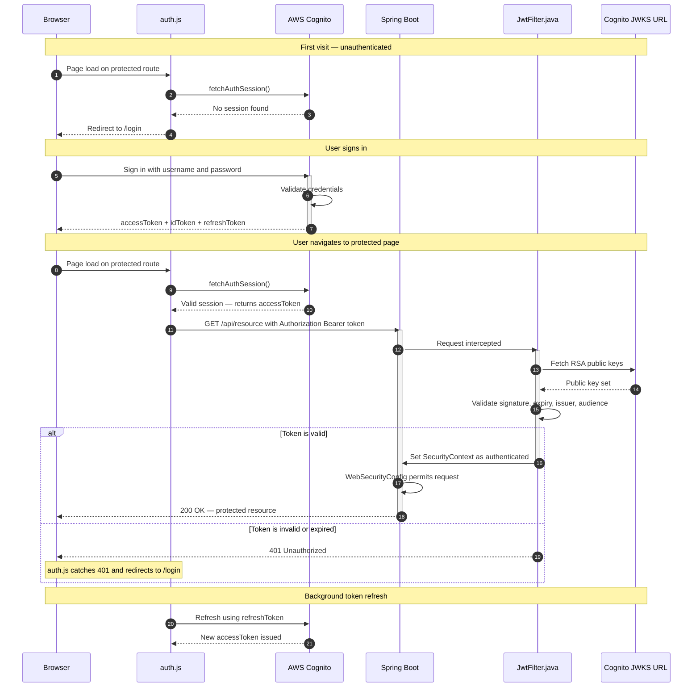
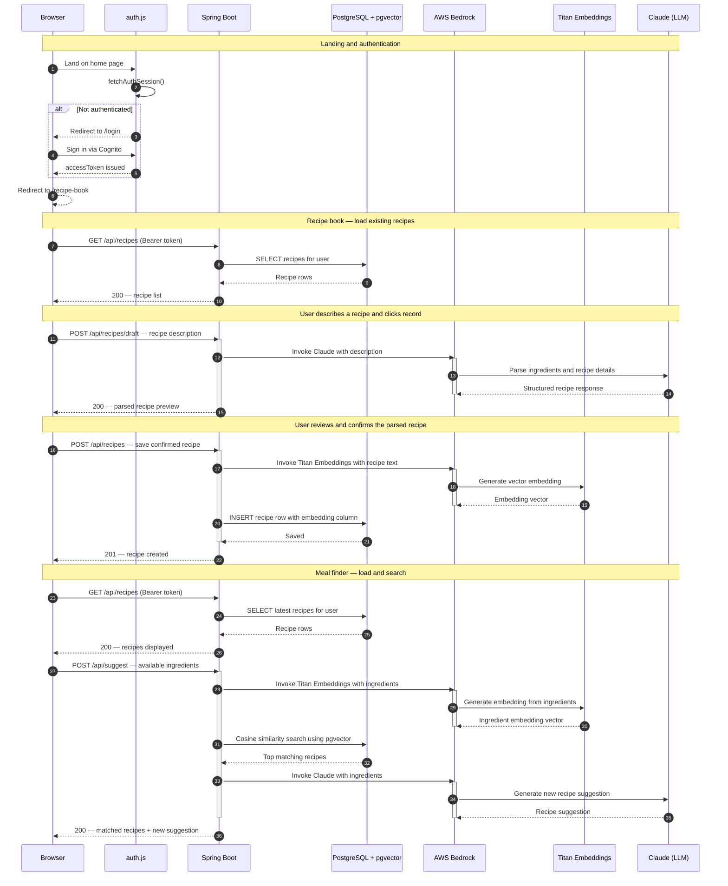
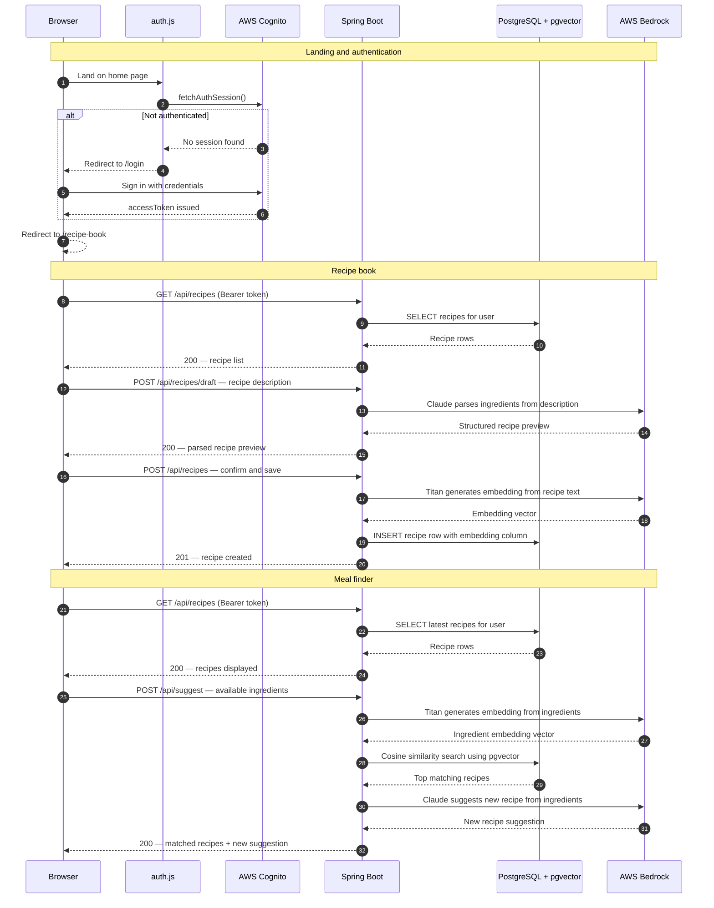

# Remi - Your Personal AI Chef

A full-stack RAG application that leverages a microservices architecture to record user-created recipes and returns the best matched recipes based on the available ingredients in the users' pantry. It also generates AI suggested recipes that can be made from the available ingredients. Built with Spring Boot, AWS Bedrock, AWS Cognito, Postgres, HTML, CSS and JavaScript. Deployed on Render.

## Architecture

### AWS Cognito, Spring Security - Authentication 

### RAG application flow

### Collapsed diagram

