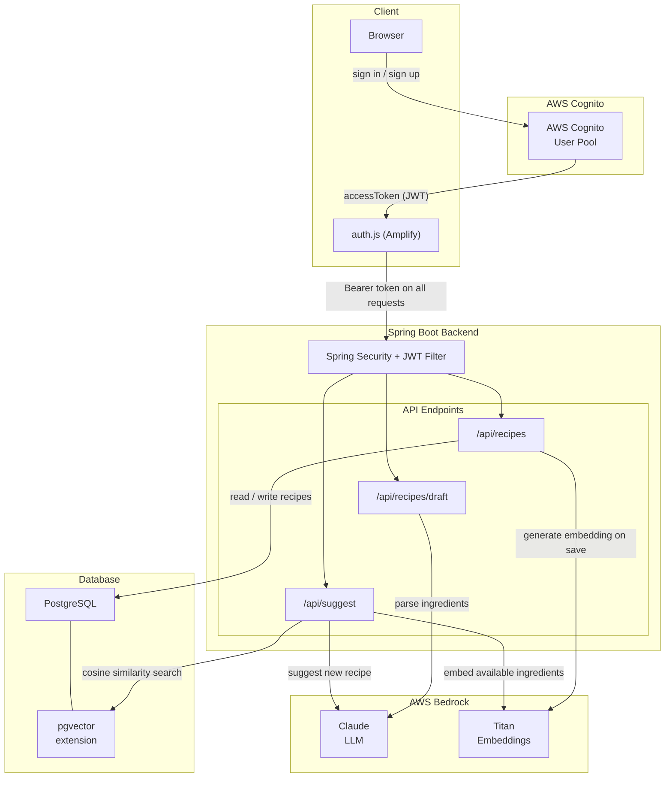
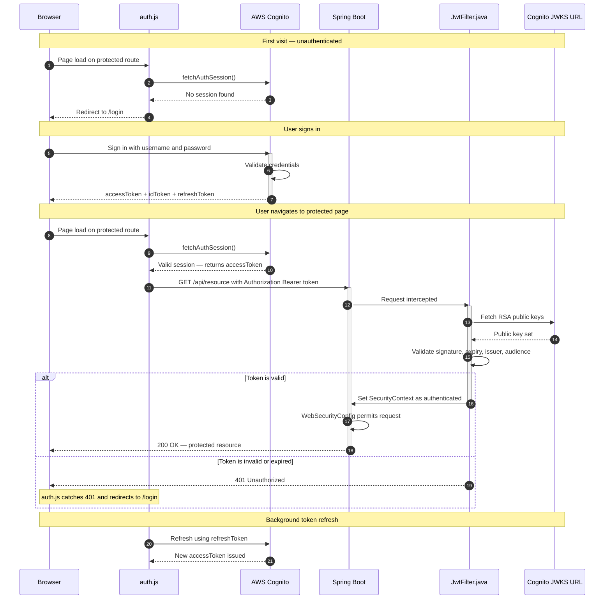
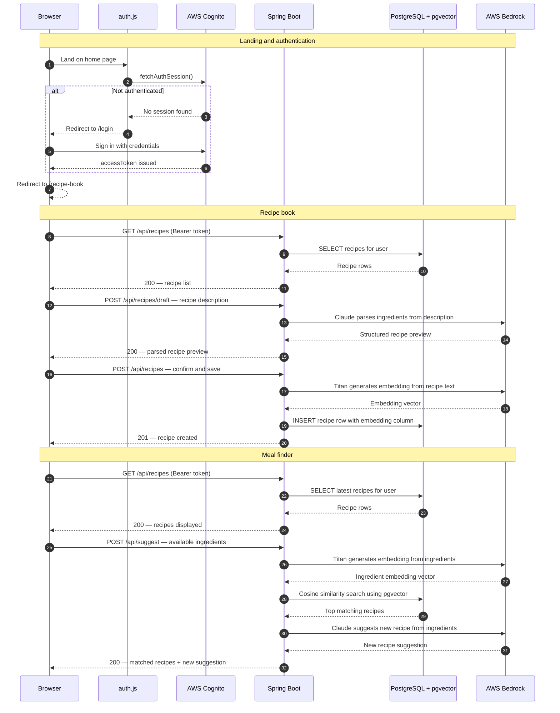

# Remi - Your Personal AI Chef

A full-stack RAG application that leverages a microservices architecture to record user-created recipes and returns the best matched recipes based on the available ingredients in the users' pantry. It also generates AI suggested recipes that can be made from the available ingredients. Built with Spring Boot, AWS Bedrock, AWS Cognito, Postgres, HTML, CSS and JavaScript. Deployed on Render.

## Architecture

Remi is a full-stack application built across three layers. The frontend is served by Spring Boot with JavaScript handling client-side authentication state via AWS Amplify. The backend is a REST API built with Spring Boot, responsible for all business logic, external service orchestration, and data persistence. All data is stored in a PostgreSQL database extended with pgvector, which enables the application to store and query vector embeddings natively alongside relational data.
Authentication is handled by AWS Cognito, which manages user identity, credential validation, and token lifecycle. AI capabilities are powered by AWS Bedrock, which provides access to two models: Claude for natural language understanding and recipe generation, and Amazon Titan for converting text into vector embeddings. 

### AWS Cognito, Spring Security - Authentication 

See Authentication Request Flow

    

Remi uses a JWT-based authentication supported by AWS Cognito. Amplify Auth provides methods to handle functions like sign-in, sign-out, and managing the tokens. Spring Security restricts the endpoints that can be accessed by the user depending on their session status. In every request, a Bearer token is passed which is verified by a JWT Filter by using the JWKS URL that has the Cognito public key. 

### RAG application flow

See RAG Application Flow

SpringBoot serves the frontend static links and handles the API calls made to fetch, save, and suggest recipes. It also manages the API calls that trigger LLM calls to AWS Bedrock, which in turn makes calls to two separate models, the Claude Haiku 4.5 and Titan Embeddings v2. 

The application takes user input in the form of natural language and parses it to identify the ingredients in the recipe and records the quantities when available. These ingredients are ranked based on their importance to the dish, and once the user confirms the parsing, they are converted into vector embeddings with additional importance given to the primary ingredients to accommodate the cases when the user only searches for the primary ingredient of the dish. These recipes are saved in Postgres and utilizes pgvector for handling calculating cosine similarity when searching for the most similar recipes based on the ingredients user has available.

When a user searches for recipes, an LLM call is also made to generate a new recipe based on the matches from the user's own recipes (puts the user's taste in context) and the available ingredients. 

